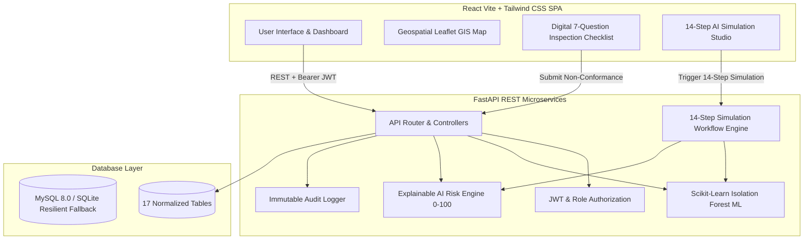
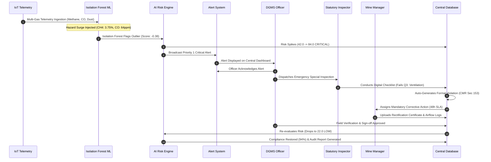

# AI-Powered Underground Mine Safety Monitoring and Rescue System — Architecture & Specifications

> **AI-Powered Underground Mine Safety Monitoring and Rescue System**  
> *Underground Mine Safety, Multi-Gas Telemetry, Worker Tracking & Rescue Operation Tracking*

---

## 1. High-Level Architecture

---

## 2. 14-Step End-to-End Governance Workflow

---

## 3. Database Normalization & Entity Relationship

The system utilizes 17 normalized relational tables:
1. `roles`: Role definitions (`SUPER_ADMIN`, `GOVERNMENT_OFFICER`, `MINE_MANAGER`, `INSPECTOR`).
2. `users`: Credentials, PBKDF2 password hashes, role relationships, mine assignment.
3. `mines`: Coal block metadata, district, state, mine type, capacity, compliance & risk metrics.
4. `mine_locations`: Underground shafts, open-pit benches, hazard zones.
5. `compliance_rules`: Statutory DGMS / MoEFCC regulations, categories, penalties.
6. `compliance_records`: Mine-level compliance status, scores, verification dates, evidence files.
7. `inspections`: Scheduled audits, inspector assignments, types, overall findings.
8. `inspection_findings`: Checklist responses (`YES`, `NO`, `NOT APPLICABLE`), non-conformance severity.
9. `violations`: Formal citations, category, severity, due dates, fines, status lifecycle.
10. `corrective_actions`: Assigned remediation plans, priority, due date, status, evidence file.
11. `sensor_readings`: 8-parameter time-series telemetry with Isolation Forest scores.
12. `environmental_readings`: Parameter summaries, statutory thresholds, and status.
13. `safety_incidents`: Accident records, injuries, investigation status.
14. `alerts`: System notifications, severity levels, acknowledgement and resolution states.
15. `notifications`: User-directed alerts.
16. `documents`: Uploaded metadata for certificates, photographs, and logs.
17. `audit_logs`: Immutable ledger of every action, actor email, IP address, and timestamp.

---

## 4. AI & Machine Learning Architecture

### A. Telemetric Anomaly Detection (Isolation Forest)
* **Algorithm**: `sklearn.ensemble.IsolationForest` with 100 estimators, 8% contamination rate.
* **Feature Vector**:
  1. Methane Concentration (`%` vol)
  2. Carbon Monoxide (`ppm`)
  3. Respirable Dust PM10 (`µg/m³`)
  4. Ambient Temperature (`°C`)
  5. Relative Humidity (`%`)
  6. Ambient Noise Level (`dB`)
  7. Air Quality Index (`AQI`)
  8. Discharge Water Quality (`pH`)
* **Output**: `is_anomaly` (boolean), `anomaly_score` (`-1.0` to `1.0`), `risk_flag` (`NORMAL`, `WARNING`, `CRITICAL`, `ANOMALY`).

### B. Explainable Risk Scoring Engine
* **Formula**:
  $$\text{Risk Score} = \text{Baseline (10)} + W_{\text{env}} + W_{\text{viol}} + W_{\text{ca}} + W_{\text{comp}} + W_{\text{safety}}$$
* **Categorization**:
  * `0 - 30`: **LOW** (Green) — Nominal operating state.
  * `31 - 60`: **MEDIUM** (Yellow) — Advisory monitoring required.
  * `61 - 80`: **HIGH** (Orange) — Regulatory intervention recommended.
  * `81 - 100`: **CRITICAL** (Red) — Mandatory stop-work & emergency inspection.

---

## 5. Security & RBAC Matrix

| Role | Mines Access | Rules Config | Inspections | Violations | Corrective Actions | Audit Logs |
| :--- | :---: | :---: | :---: | :---: | :---: | :---: |
| **Super Admin** | Full (CRUD) | Full (CRUD) | Full (CRUD) | Full (CRUD) | Full (CRUD) | View All |
| **Govt Officer** | Assigned/All | View | Schedule/View | Issue/Review | Verify/Signoff | View All |
| **Mine Manager** | Own Mine | View | View | Respond | Submit Evidence | Restricted |
| **Inspector** | Assigned | View | Audit/Fill | Detect/Flag | View | Restricted |
